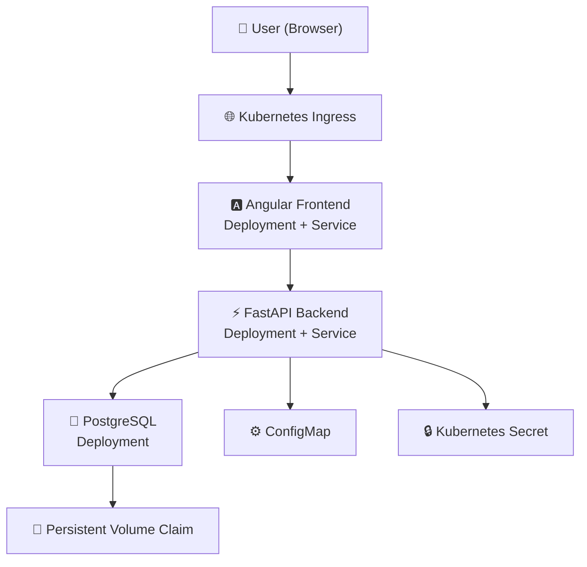

# 🚀 Daily Execution Tracker

A full-stack productivity application built to track daily tasks, activities, and execution progress. The project demonstrates modern backend development with **FastAPI**, **Angular**, **PostgreSQL**, **Docker**, and **Kubernetes**.

---

# ✨ Features

* 🔐 JWT Authentication
* 👤 User Registration & Login
* ✅ Task Management (Create, View, Complete & Delete)
* 📊 Daily Activity Summary
* 📅 Date-wise Activity Tracking
* 🐘 PostgreSQL Database
* 🐳 Dockerized Frontend & Backend
* ☸️ Kubernetes Deployment
* 🌐 Ingress-based Routing
* ⚙️ ConfigMaps & Secrets
* 💾 Persistent Volume Claims (PVC)

---

# 🏗️ Architecture



---

# 🛠️ Tech Stack

## Frontend

* Angular
* TypeScript
* Bootstrap
* Nginx

## Backend

* FastAPI
* SQLAlchemy
* Alembic
* JWT Authentication

## Database

* PostgreSQL

## DevOps

* Docker
* Docker Compose
* Kubernetes (Minikube)
* Ingress NGINX

---

# 📁 Project Structure

```text
daily-execution-tracker
│
├── backend/
│   ├── app/
│   ├── alembic/
│   ├── Dockerfile
│   └── requirements.txt
│
├── frontend/
│   ├── src/
│   ├── nginx.conf
│   └── Dockerfile
│
├── k8s/
│   ├── backend-config.yaml
│   ├── backend-deployment.yaml
│   ├── backend-secret.yaml
│   ├── backend-service.yaml
│   ├── det-ingress.yaml
│   ├── frontend-deployment.yaml
│   ├── frontend-service.yaml
│   ├── postgres-deployment.yaml
│   ├── postgres-pvc.yaml
│   ├── postgres-service.yaml
│   └── README.md
│
├── docs/
│   └── images/
│
├── docker-compose.yml
└── README.md
```

---

# 🐳 Running with Docker

Clone the repository

```bash
git clone <repository-url>
cd daily-execution-tracker
```

Start the application

```bash
docker compose up --build
```

Frontend

```
http://localhost:4200
```

Backend

```
http://localhost:8000
```

---

# ☸️ Running with Kubernetes

This project also supports deployment on Kubernetes using Minikube.

Deployment manifests include:

* Backend Deployment
* Frontend Deployment
* PostgreSQL Deployment
* Persistent Volume Claim
* ConfigMap
* Secret
* Ingress

For detailed deployment instructions, see:

```text
k8s/README.md
```

---

# 📸 Screenshots

> Add screenshots after deployment.

Example:

```
docs/images/login.png

docs/images/dashboard.png

docs/images/tasks.png
```

---

# ✅ Features Demonstrated

* Full-stack application development
* REST API design
* JWT Authentication
* Angular + FastAPI integration
* PostgreSQL integration
* Docker containerization
* Docker Compose orchestration
* Kubernetes deployments
* Services
* ReplicaSets
* Persistent Volumes
* ConfigMaps
* Secrets
* Ingress Controller
* End-to-end application deployment

---

# 🚧 Future Improvements

* Readiness Probes
* Liveness Probes
* Resource Requests & Limits
* Horizontal Pod Autoscaler (HPA)
* Rolling Updates & Rollbacks
* GitHub Actions CI/CD Pipeline
* Cloud Deployment (AWS/GCP/Azure)

---

# 👨‍💻 Author

**Nandu Krishnan**

Built as a learning project to gain hands-on experience with modern backend development, containerization, and Kubernetes deployment.
