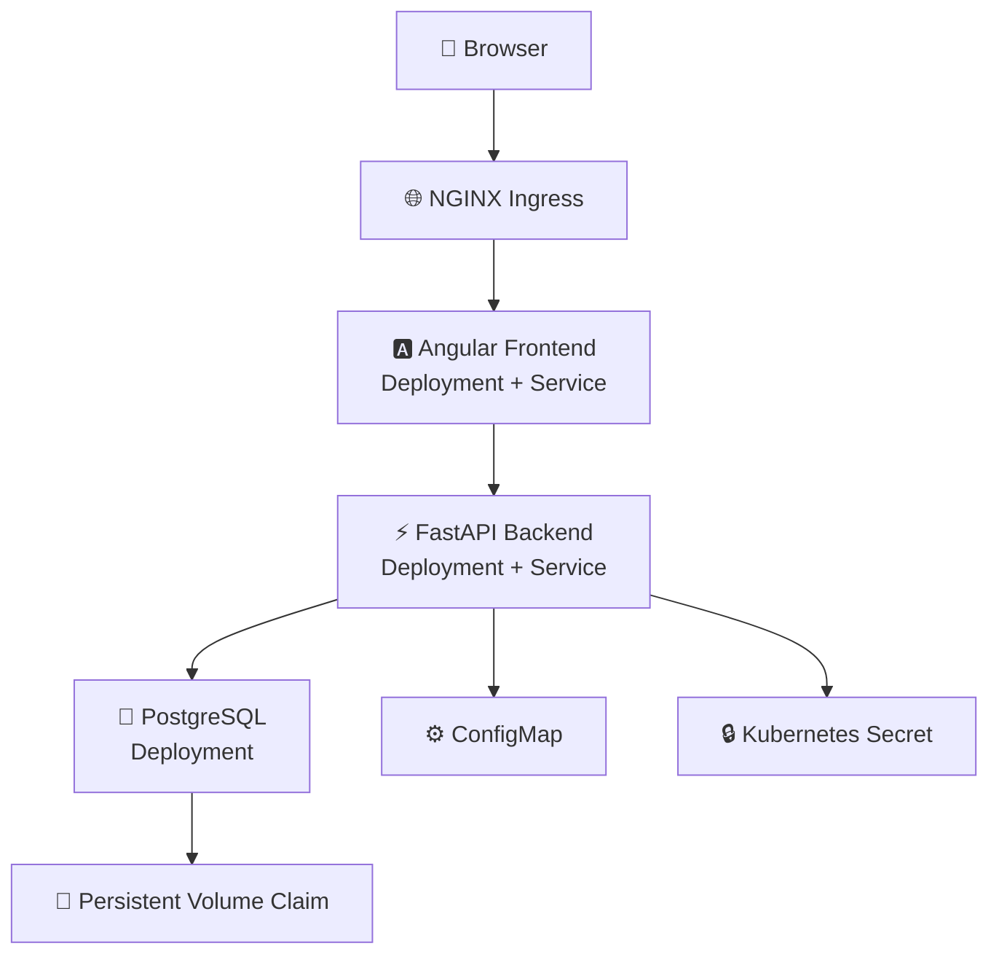

# Daily Execution Tracker - Kubernetes Deployment

## Overview

This directory contains the Kubernetes manifests required to deploy the **Daily Execution Tracker** application on a local Kubernetes cluster using **Minikube**.

The deployment includes:

* Angular Frontend
* FastAPI Backend
* PostgreSQL Database
* Persistent Storage
* ConfigMaps
* Kubernetes Secrets
* NGINX Ingress

---

# 🏗️ Kubernetes Architecture




---

# Kubernetes Components

## Frontend

* Angular application
* Served using NGINX
* Exposed through a NodePort Service
* Routed via Ingress

Files:

* `frontend-deployment.yaml`
* `frontend-service.yaml`

---

## Backend

* FastAPI REST API
* JWT Authentication
* SQLAlchemy
* Alembic Migrations

Files:

* `backend-deployment.yaml`
* `backend-service.yaml`

---

## PostgreSQL

* PostgreSQL 17
* Persistent Volume Claim
* ClusterIP Service

Files:

* `postgres-deployment.yaml`
* `postgres-service.yaml`
* `postgres-pvc.yaml`

---

## Configuration

Configuration is managed using Kubernetes ConfigMaps.

File:

* `backend-config.yaml`

---

## Secrets

Sensitive information is managed using Kubernetes Secrets.

Examples:

* Database Password
* JWT Secret

File:

* `backend-secret.yaml`

---

## Ingress

NGINX Ingress routes requests to the appropriate services.

| Path          | Destination |
| ------------- | ----------- |
| `/auth`       | Backend     |
| `/tasks`      | Backend     |
| `/activities` | Backend     |
| `/health`     | Backend     |
| `/`           | Frontend    |

File:

* `det-ingress.yaml`

---

# Prerequisites

Install:

* Docker Desktop
* Minikube
* kubectl

Verify installation:

```bash
docker --version
kubectl version --client
minikube version
```

---

# Start Minikube

```bash
minikube start --driver=docker
```

Verify:

```bash
kubectl get nodes
```

Expected:

```text
NAME        STATUS   ROLES           AGE
minikube    Ready    control-plane
```

---

# Build Docker Images

## Backend

```bash
docker build -t daily-execution-tracker-backend:latest .
```

```bash
minikube image load daily-execution-tracker-backend:latest
```

---

## Frontend

```bash
docker build -t daily-execution-tracker-frontend:latest .
```

```bash
minikube image load daily-execution-tracker-frontend:latest
```

---

# Deploy to Kubernetes

## PostgreSQL

```bash
kubectl apply -f postgres-pvc.yaml
kubectl apply -f postgres-deployment.yaml
kubectl apply -f postgres-service.yaml
```

---

## ConfigMap & Secret

```bash
kubectl apply -f backend-config.yaml
kubectl apply -f backend-secret.yaml
```

---

## Backend

```bash
kubectl apply -f backend-deployment.yaml
kubectl apply -f backend-service.yaml
```

---

## Frontend

```bash
kubectl apply -f frontend-deployment.yaml
kubectl apply -f frontend-service.yaml
```

---

## Ingress

Enable the addon:

```bash
minikube addons enable ingress
```

Apply the Ingress:

```bash
kubectl apply -f det-ingress.yaml
```

Run:

```bash
minikube tunnel
```

Update your hosts file:

```text
127.0.0.1 det.local
```

---

# Database Migration

Open the backend container:

```bash
kubectl exec -it deployment/det-backend -- sh
```

Run:

```bash
alembic upgrade head
```

Verify:

```bash
alembic current
```

---

# Useful Commands

## View Resources

```bash
kubectl get pods
kubectl get deployments
kubectl get services
kubectl get pvc
kubectl get ingress
```

---

## View Logs

Backend

```bash
kubectl logs deployment/det-backend -f
```

Frontend

```bash
kubectl logs deployment/det-frontend -f
```

PostgreSQL

```bash
kubectl logs deployment/postgres -f
```

---

## Connect to PostgreSQL

```bash
kubectl exec -it deployment/postgres -- psql -U postgres -d daily_tracker
```

---

# Features Verified

* Kubernetes Deployments
* ReplicaSets
* Services
* ConfigMaps
* Kubernetes Secrets
* Persistent Volume Claims
* PostgreSQL Deployment
* Angular Deployment
* FastAPI Deployment
* JWT Authentication
* Ingress Routing
* Task CRUD APIs
* Activity Summary APIs
* Frontend ↔ Backend Communication
* Backend ↔ PostgreSQL Communication

---

# Troubleshooting

### Pods

```bash
kubectl get pods
kubectl describe pod <pod-name>
```

### Services

```bash
kubectl get services
```

### Ingress

```bash
kubectl get ingress
```

### Backend Logs

```bash
kubectl logs deployment/det-backend -f
```

### Verify Database

```sql
SELECT * FROM users;
```

---

# Future Improvements

* Readiness Probes
* Liveness Probes
* Resource Requests & Limits
* Horizontal Pod Autoscaler (HPA)
* Rolling Updates
* Rollbacks
* GitHub Actions CI/CD
* Cloud Deployment (AWS, Azure, GCP)

---

This Kubernetes deployment demonstrates the deployment of a modern three-tier application using Kubernetes, including persistent storage, configuration management, authentication, and ingress-based routing.
